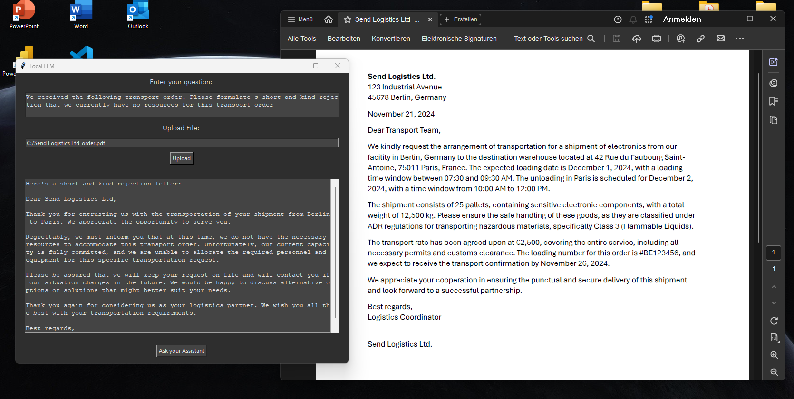
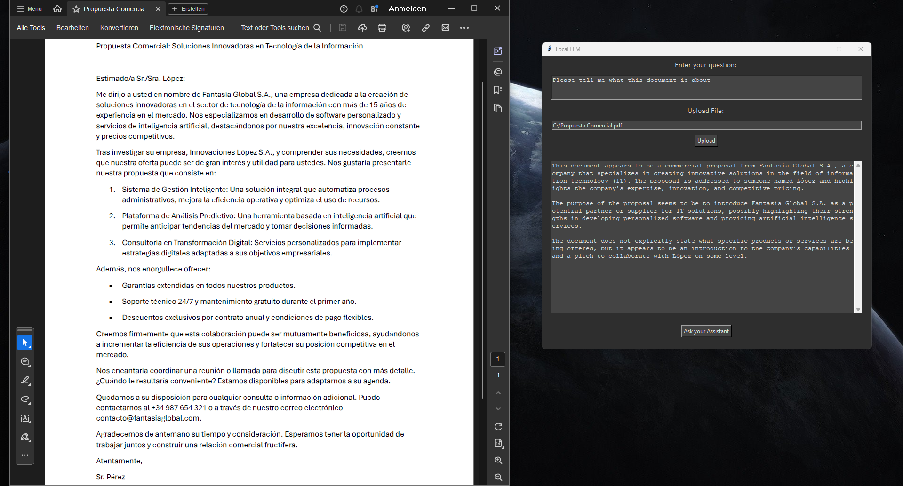
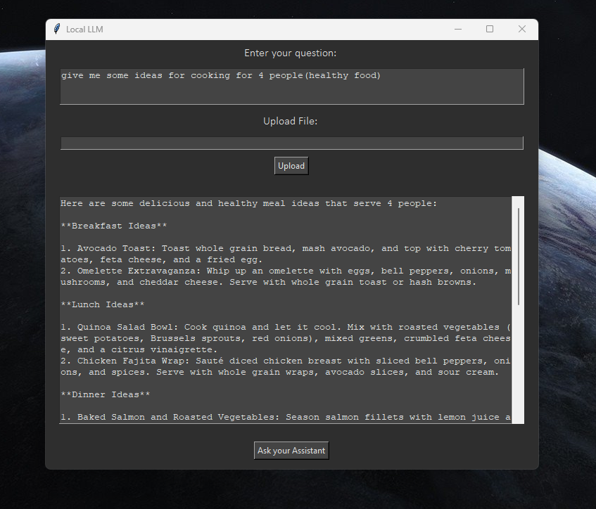

# AI Desktop App

This Desktop App is a AI Assistant which answers question, explains things or performs tasks. Additionlly it can be provided with files. It runs completly locally on an Ollama model which means that maximum privacy is granted since no data is sent to a company or third party server. With this, it's perfect to analyze financial data, PDFs, DOCXs or images. Ask questions on any topic, brainstorm ideas, get inspiration, translate texts, correct texts, write emails and so on. The app has a graphical user interface (GUI) from tkinter. 

## Getting started

To set up this repo create a folder for the project on your system (instructions for windows), open a terminal window, write "cd" and paste the folder path `cd "C:\Users\user\path\to\your\folder"`. Then type `git clone https://github.com/Yesitin/AI-Desktop-App.git` to download the whole repository (ensure that you have installed python and git).

Next, create a virtual environment in order to avoid dependency conflicts. For this, type into the terminal `python -m venv env`. With `env\Scripts\activate` you start the environment.

Now you can install all dependencies with `pip install -r requirements.txt`.

Furthermore, you need to install Ollama _(https://ollama.com/download/OllamaSetup.exe)_. After completing, open a new terminal and type `ollama pull llama3:8b` to download a specific model. You can choose between several model. An overview of all available models at _https://ollama.com/search_. To start the model type `ollama run llama3:8b`. The model has to be activated everytime in this seperate terminal.

After the project is set up you can start the app within the virtual environments terminal with `python app.py`.

## Examples

- Creating a kind rejection of the transport order:

- Left the spanish written business offer and right the app which performs instructions on it:

- Ask for help on any topic (even cooking :))

